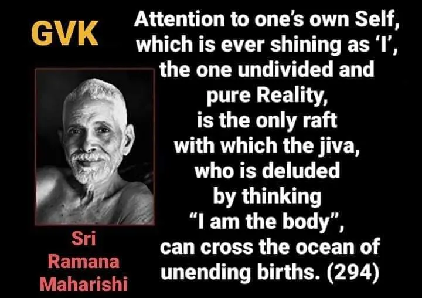

Attention to one’s own Self, which is ever shining as ‘I’, the one undivided and pure Reality, is the only raft with which the jiva, who is deluded by thinking “l am the body”, can cross the ocean of unending births. (294)
