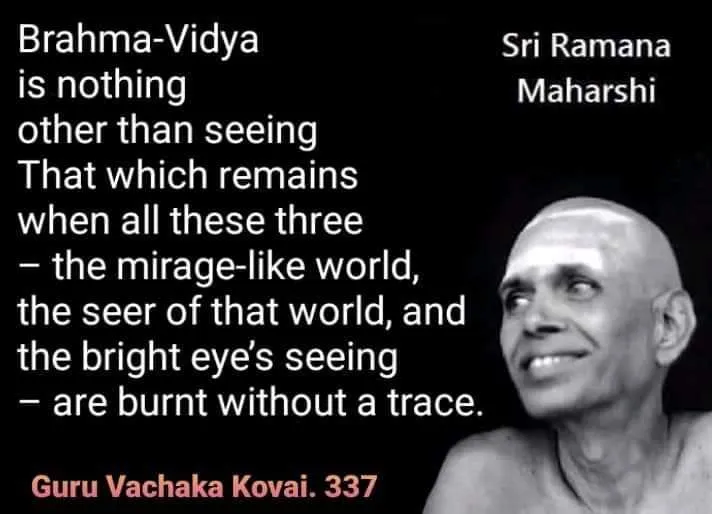

Brahma-Vidya  is nothing other than seeing That which remains  when all these three  — the mirage-like world, the seer of that world, and the bright eye’s seeing  — are burnt without a trace.  Guru Vachaka Kovai. 337 
